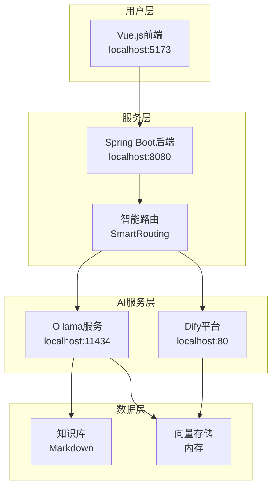

# 🚀 RAG-Try 智能客服系统快速开始指南

## 📋 系统概述

RAG-Try 是一个完整的智能客服解决方案，包含以下组件：
- **Dify平台**：提供工作流和模型管理
- **Ollama服务**：本地LLM模型服务
- **Spring Boot后端**：智能路由和API服务
- **Vue.js前端**：用户交互界面

## 🛠️ 环境要求

- **Java 17+** (已更新)
- **Maven 3.6+**
- **Node.js 16+**
- **Docker & Docker Desktop**
- **Git**
- **Ollama**

## 📦 第一步：环境准备

### 1.1 安装Docker和Docker Desktop
```bash
# 下载并安装Docker Desktop
# https://www.docker.com/products/docker-desktop/
```

### 1.2 安装Ollama
```bash
# Windows (需要WSL环境)
# 下载 https://ollama.com/download

# macOS
brew install ollama

# Linux
curl -fsSL https://ollama.com/install.sh | sh
```

### 1.3 安装Node.js
```bash
# 下载并安装Node.js 16+
# https://nodejs.org/
```

## 🔧 第二步：克隆和配置Dify

### 2.1 克隆Dify仓库
```bash
git clone https://github.com/langgenius/dify.git
cd dify
```

### 2.2 配置Docker环境
```bash
cd docker
cp .env.example .env
```

### 2.3 修改.env文件
在`.env`文件最底部添加：
```bash
# Ollama配置
OLLAMA_BASE_URL=http://host.docker.internal:11434
```

### 2.4 修改docker-compose.yaml
找到`api`和`worker`服务，分别添加：

```yaml
api:
  environment:
    # ... 其他环境变量
    OLLAMA_BASE_URL: ${OLLAMA_BASE_URL:-http://host.docker.internal:11434}
  extra_hosts:
    - "host.docker.internal:host-gateway"

worker:
  environment:
    # ... 其他环境变量  
    OLLAMA_BASE_URL: ${OLLAMA_BASE_URL:-http://host.docker.internal:11434}
  extra_hosts:
    - "host.docker.internal:host-gateway"
```

## 🤖 第三步：部署Ollama模型

### 3.1 启动Ollama服务
```bash
# 命令行方式
ollama serve

# 或使用桌面版（推荐Windows用户）
```

### 3.2 下载模型
```bash
# 下载LLM模型（约4GB）
ollama pull qwen2:7b

# 下载embedding模型（可选，用于向量检索）
ollama pull nomic-embed-text

# 验证模型
ollama list
```

## 🐳 第四步：启动Dify服务

### 4.1 启动Docker容器
```bash
cd dify/docker
docker compose up -d
```

### 4.2 检查服务状态
```bash
# 查看容器状态
docker compose ps

# 查看日志
docker compose logs -f api
```

### 4.3 访问Dify平台
浏览器访问：http://localhost

⚠️ **注意**：如果80端口被占用，检查`docker-compose.yaml`中的端口映射

## ⚙️ 第五步：配置Dify平台

### 5.1 完成初始化
1. 访问 http://localhost
2. 完成首次安装引导
3. 创建管理员账户

### 5.2 添加Ollama模型供应商
1. 进入**设置** → **模型供应商**
2. 点击**添加模型供应商**
3. 选择**Ollama**
4. 配置：
   - **URL**: `http://host.docker.internal:11434`
   - **模型名称**: `qwen2:7b`

### 5.3 创建知识库
1. 进入**知识库**
2. 点击**创建知识库**
3. 上传文档或手动添加内容
4. 配置处理参数：
   - ✅ 勾选预处理规则
   - ❌ 不选Q&A分段（需embedding模型）
   - 倒排索引 topk=3

### 5.4 创建应用
1. 进入**应用** → **创建应用**
2. 选择**聊天助手**模板
3. 配置：
   - 编写角色提示词
   - 关联创建的知识库
   - 启用开场白功能
4. **发布应用**并获取API密钥

## 🚀 第六步：启动后端服务

### 6.1 克隆项目
```bash
git clone <your-rag-try-repository>
cd rag-try
```

### 6.2 配置应用
编辑 `src/main/resources/application.yml`：

```yaml
# Dify API配置
dify:
  api:
    base-url: http://localhost/v1  # Dify API地址
    api-key: app-xxx  # 从Dify应用中获取
    timeout: 30000
    debug: true

# RAG配置
rag:
  ollama:
    base-url: http://localhost:11434
    embedding-model: nomic-embed-text
    chat-model: qwen2:7b
  search:
    similarity-threshold: 0.7
    max-results: 5

# 智能路由配置
smart-routing:
  enabled: true
  strategy: rag-first  # rag-first, dify-first, parallel
  fallback-enabled: true

# 服务器配置
server:
  port: 8080
```

### 6.3 启动后端
```bash
# 使用Maven启动
mvn spring-boot:run

# 或者编译后运行
mvn clean package
java -jar target/rag-try-1.0.0.jar
```

### 6.4 验证后端服务
```bash
# 健康检查
curl http://localhost:8080/api/system/health

# 快速测试
curl -X POST "http://localhost:8080/api/system/test?message=你好"
```

## 🌐 第七步：启动前端服务

### 7.1 安装依赖
```bash
cd frontend
npm install
```

### 7.2 启动开发服务器
```bash
npm run dev
```

### 7.3 访问前端
浏览器访问：http://localhost:5173

## 🧪 第八步：系统测试

### 8.1 端口检查
确保以下端口可用：
- **80**: Dify平台
- **8080**: Spring Boot后端
- **5173**: Vue.js前端
- **11434**: Ollama服务

### 8.2 功能测试

#### 测试Dify连接
```bash
curl -X POST http://localhost:8080/api/dify/chat \
  -H "Content-Type: application/json" \
  -d '{"message": "你好，请介绍一下自己"}'
```

#### 测试RAG功能
```bash
curl -X POST http://localhost:8080/api/rag/query \
  -H "Content-Type: application/json" \
  -d '{"question": "什么是RAG？"}'
```

#### 测试智能路由
```bash
curl -X POST http://localhost:8080/api/chat/send \
  -H "Content-Type: application/json" \
  -d '{"message": "请帮我解答技术问题"}'
```

### 8.3 前端界面测试
1. 访问前端界面
2. 测试聊天功能
3. 验证消息收发
4. 检查错误处理

## 🏗️ 系统架构



## 🔧 常见问题排除

### Ollama连接失败
```bash
# 检查Ollama服务
ollama list

# 重启Ollama
ollama serve

# 检查端口占用
netstat -ano | findstr :11434
```

### Dify无法访问
```bash
# 检查Docker容器
docker compose ps

# 查看容器日志
docker compose logs api

# 重启容器
docker compose restart
```

### 后端启动失败
```bash
# 检查Java版本
java -version

# 重新编译
mvn clean compile

# 查看详细错误
mvn spring-boot:run -X
```

### 前端无法访问后端
1. 检查后端是否启动(localhost:8080)
2. 检查CORS配置
3. 查看浏览器控制台错误
4. 确认API接口路径

## 📚 API接口文档

### 核心接口

| 接口 | 方法 | 描述 |
|------|------|------|
| `/api/chat/send` | POST | 智能路由聊天 |
| `/api/dify/chat` | POST | Dify直接对话 |
| `/api/rag/query` | POST | RAG问答 |
| `/api/system/health` | GET | 系统健康检查 |
| `/api/system/test` | POST | 快速测试 |

### 前端功能
- 💬 实时聊天界面
- 🔄 消息状态显示
- ⚡ 自动重试机制
- 🎨 现代化UI设计

## 🎯 下一步

1. **自定义知识库**：添加您的业务知识
2. **调优模型参数**：根据实际需求调整
3. **扩展功能**：添加用户管理、数据统计等
4. **生产部署**：配置HTTPS、负载均衡等

## 📞 技术支持

如遇到问题，请检查：
1. 所有服务是否正常启动
2. 端口是否被占用
3. 网络连接是否正常
4. 配置文件是否正确

---

**🎉 恭喜！您的RAG-Try智能客服系统已经成功部署！**
